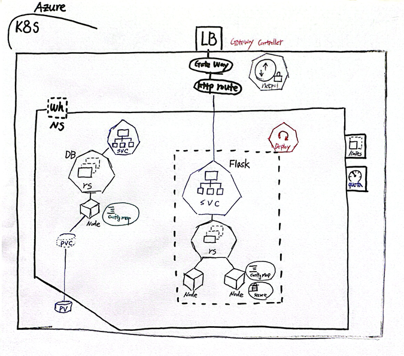

# 🐧 Genius Linux: AI-Powered Linux Master Prep
Gemini 2.5 AI 기반 오답 해설 기능을 탑재한 리눅스 마스터 2급 자격증 대비 웹 애플리케이션

## 왜 만들었는가?
### 1. 자격증 취득의 효율성 극대화
### 리눅스 마스터 2급 자격증을 준비하며, 단순히 답안지만 보고 정답을 외우는 기존 방식의 한계를 느꼈습니다.

### 문제 해설을 위해서 gemini api를 사용해서 그 중 무료 버전에서 가장 사용하기 편리한 gemini-2.5-flash 모델을 사용하였습니다.

### 2. 클라우드 엔지니어(Cloud SE)로서의 역량 증명
### 단순한 코딩 능력을 넘어, 실제 인프라 환경에서 앱이 어떻게 동작하고 배포되는지 증명하고자 했습니다.

### Docker를 통한 컨테이너 최적화, MySQL 데이터베이스 설계, requirements.txt를 통한 의존성 관리 등 실무적인 백엔드 아키텍처를 직접 구축하는 경험을 쌓고자 했습니다.

### 3. AI 기술의 실무적 적용 연습
### 텍스트 생성 인공지능(LLM)을 실제 서비스에 어떻게 접목할 수 있을지 고민했습니다.

### 원래 의도는 gemini를 통해 문제 생성을 하고 틀린 문제만 DB에 저장되게 끔 의도였지만, 오류 때문에 문제는 고정 DB에서 불러오고, 해설에만 AI를 통해 진행하는'하이브리드 방식'을 선택하여 시스템의 안정성을 확보하였고 추후 리팩토링 하여 다양한 기능을 선보일 예정입니다.

## 🚀 프로젝트 개요
리눅스 마스터 2급 자격증 취득을 준비하는 분들을 위해, 단순한 문제 풀이를 넘어 gemini가 틀린 원인을 분석하고 맞춤형 해설을 제공하는 효율적인 학습 도구입니다. 경량화된 Docker 환경을 지원하여 클라우드 환경 어디서든 즉시 배포 및 실행이 가능하도록 설계되었습니다.

## ✨ 주요 기능 (Key Features)
고정 기출문제 세트: 엄선된 리눅스 마스터 2급 핵심 기출문제 20문항을 제공합니다.

AI 맞춤형 해설: Google Gemini 2.5 Flash 모델을 연동하여, 사용자가 선택한 오답의 원인을 분석하고 정답의 핵심 개념을 요약해 줍니다.

지능형 오답 저장소: 틀린 문제는 자동으로 데이터베이스에 기록되며, 언제든지 다시 확인하고 AI 해설을 요청할 수 있습니다.

학습 가이드 제공: 시험 일정에 따른 D-Day 계산 및 AI의 합격 전략 조언 기능을 제공합니다.

유튜브 연동 학습: 오답 개념과 관련된 유튜브 강의 검색 링크를 자동으로 생성하여 추가 학습을 돕습니다.

## 🛠 기술 스택 (Tech Stack)
## Backend
Language: Python 3.14.3

Framework: Flask

ORM: SQLAlchemy

Database: SQLite (Development) / MySQL (Production Ready)

AI SDK: google-genai (Latest Version)

## Infrastructure
Container: Docker (python:3.14.3-slim)

VCS: GitHub

⚙️ 실행 방법 (Getting Started)
1. 로컬 환경 실행
```Bash
# 의존성 설치
pip install -r requirements.txt

# DB 초기화 및 문제 삽입 (중요)
python seed_db.py

# 앱 실행
python run.py
```
2. Docker 환경 실행
```Bash
# 이미지 빌드
docker build -t linux-master-app .

# 컨테이너 실행
docker run -d -p 5000:5000 --name linux-app linux-master-app
```

📁 프로젝트 구조 (Project Structure)
## 📁 프로젝트 구조 (Project Structure)
```plaintext
.
├── app/
│   ├── models.py          # SQLAlchemy DB 모델 정의
│   ├── routes/
│   │   └── main.py        # 핵심 비즈니스 로직 및 라우팅
│   ├── services/
│   │   └── gemini_service.py # Gemini AI API 연동부
│   └── templates/         # Jinja2 템플릿 파일
├── Dockerfile             # 경량화 빌드 설정
├── requirements.txt       # 패키지 의존성 목록
├── seed_db.py             # 초기 데이터 삽입 스크립트
└── run.py                 # 애플리케이션 엔트리 포인트
```

👤 Author
MyosoonHwang - GitHub



# 트러블 슈팅 및 어려웠던 점
## 1. 배포 (Deployment)와 서비스 (Service)의 분리
### 문제: 처음 설계 구성대로 배포 진행했을 때,  Deployment를 배포하면 서비스 (Service)도 같이 생성될 줄 알았지만, 실제로는 그렇지 않았음.

### 개념: 쿠버네티스에서 배포와 서비스는 서로 다른 리소스이며, 각각 별도로 배포해야 해야 함.

### 해결: 배포를 생성한 후, 서비스를 추가로 배포하여 배포된 애플리케이션의 엔드포인트를 노출.

## 2. 게이트웨이 (Gateway)와 서비스 (Service)의 연동
### 문제: 처음에 게이트웨이 (Gateway)를 연결하기 위해 다시 서비스 (Service)를 배포해야 했던 점을 깨달음.

### 개념: 게이트웨이 리소스는 서비스 리소스와 연동되어 트래픽을 서비스로 전달하는 구조입니다.

### 해결: 서비스를 배포하여 게이트웨이 리소스가 해당 서비스의 엔드포인트를 노출할 수 있도록 구성했습니다.

## 3. DB와 PVC (PersistentVolumeClaim)의 연동
### 문제: DB에서 PVC (PersistentVolumeClaim)를 연결할 때 서로 바라보게 yaml 파일을 작성하는 것이 어려웠음.

### 과정: DB의 deployment.yaml 파일에서 PVC를 사용하도록 볼륨 설정을 정의해야 하며, 동시에 PVC의 yaml 파일에서 DB가 해당 PVC를 사용할 수 있도록 볼륨 정보를 정의해야함.

### 해결: DB의 deployment.yaml 파일과 PVC의 yaml 파일에서 ** PVC의 이름과 DB의 claimName ** 이 서로 일치하도록 작성하여, DB가 PVC를 통해 영구 스토리지에 데이터를 저장할 수 있도록 구성.

## 4. L7 LB (LoadBalancer)와 게이트웨이 (Gateway), HTTPRoute 계층의 위치
### 문제: L7 LB (LoadBalancer)와 게이트웨이 (Gateway), HTTPRoute 계층이 어디에 정확히 위치하는지 이해하기 어려웠음.

### 개념: 외부 트래픽을 처리하는 L7 로드밸런서는 클러스터 외부에 위치하며, 게이트웨이 컨트롤러와 연동되어 트래픽을 관리. 게이트웨이 리소스는 클러스터 내부에 위치하며, 외부 트래픽을 클러스터 내부의 서비스로 전달하는 구조. HTTPRoute 리소스는 게이트웨이 리소스 아래에 위치하며, 트래픽을 특정 서비스로 라우팅하는 규칙을 정의하는 구조.

### 해결: 다이어그램을 통해 L7 로드밸런서와 게이트웨이, HTTPRoute 계층의 위치를 시각적으로 명확하게 표시하여 문제를 해결함.